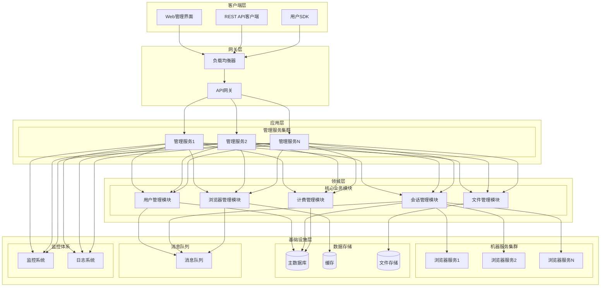
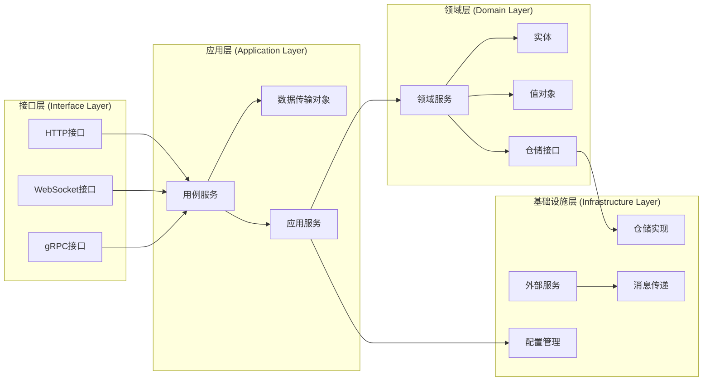

# 架构改进文档

## 1. 架构调整方案概述

### 1.1 改进目标

基于对当前系统的全面分析，本次架构改进旨在实现以下目标：

1. **安全性增强**: 修复所有已识别的安全漏洞，建立安全防护体系
2. **性能优化**: 关键性能指标提升 3-10 倍
3. **可扩展性**: 支持水平扩展，满足大规模部署需求
4. **可维护性**: 清晰的模块划分，降低代码复杂度
5. **可测试性**: 提高测试覆盖率，支持自动化测试

### 1.2 设计原则

遵循以下架构设计原则：

- **单一职责原则**: 每个模块只负责一个明确的功能
- **开闭原则**: 对扩展开放，对修改关闭
- **依赖倒置原则**: 高层模块不依赖低层模块，都依赖抽象
- **接口隔离原则**: 使用多个专门的接口，而不是单一的总接口
- **领域驱动设计**: 以业务领域为核心进行架构设计

### 1.3 变更原因说明

当前系统在功能扩展性和资源隔离方面存在以下问题：

1. **安全性问题**: 密码哈希算法不安全，文件上传存在漏洞
2. **性能瓶颈**: 浏览器启动慢，数据库查询效率低，内存泄漏风险
3. **架构耦合**: 模块间依赖复杂，缺乏清晰的分层设计
4. **资源隔离不足**: 多个会话共享临时目录，缺乏数据隔离
5. **状态管理分散**: Cookies和LocalStorage配置未统一管理
6. **扩展性限制**: 新增功能需要修改多个模块，耦合度高
7. **资源清理不完善**: 会话结束后资源清理机制不健全

## 2. 系统架构设计

### 2.1 整体架构图

### 2.2 模块划分图

### 2.3 技术选型依据

| 组件 | 当前技术 | 改进后技术 | 选择理由 |
|------|----------|------------|----------|
| **架构模式** | 三层架构 | 分层架构 + DDD | 清晰职责分离，易于测试和维护 |
| **认证方式** | SHA-256哈希 | bcrypt哈希 + JWT | 安全性大幅提升 |
| **数据隔离** | 共享目录 | 独立用户数据目录 | 提高安全性和隔离性 |
| **状态管理** | 内存存储 | 混合存储(内存+持久化) | 提高可靠性和恢复能力 |
| **资源管理** | 定时清理 | 生命周期管理 + 连接池 | 精确控制资源使用 |
| **通信机制** | WebSocket+gRPC | WebSocket+gRPC+消息队列 | 提高系统可靠性和扩展性 |
| **浏览器管理** | 按需创建 | 连接池 + 预热机制 | 大幅提升会话创建速度 |

## 3. 需要重构的组件及其依赖关系

### 3.1 核心组件重构

#### 3.1.1 浏览器服务 (src/machine/browser.service.ts)

**依赖关系：**
- 依赖：配置服务、指纹生成器、代理服务
- 被依赖：会话控制器、事件处理器

**重构内容：**
- 添加用户数据目录管理
- 实现Cookies和LocalStorage初始化
- 增强资源清理机制

#### 3.1.2 会话管理 (src/controllers/session.controller.ts)

**依赖关系：**
- 依赖：会话服务、用户服务、浏览器服务
- 被依赖：路由层、SDK

**重构内容：**
- 扩展会话创建参数
- 添加资源分配逻辑
- 实现会话状态持久化

#### 3.1.3 文件管理 (src/controllers/file.controller.ts)

**依赖关系：**
- 依赖：文件系统、临时目录配置
- 被依赖：路由层、CDP处理器

**重构内容：**
- 实现用户级别的文件隔离
- 添加文件生命周期管理
- 优化文件清理策略

### 3.2 新增组件

#### 3.2.1 数据隔离服务 (src/services/data-isolation.service.ts)

**职责：**
- 管理用户数据目录
- 处理Cookies和LocalStorage隔离
- 实现数据持久化和恢复

#### 3.2.2 资源管理服务 (src/services/resource-manager.service.ts)

**职责：**
- 分配和监控资源
- 实现资源回收策略
- 提供资源使用统计

## 4. 具体实施步骤和时间预估

### 阶段一：基础架构调整 (预估2周)

1. **数据隔离服务开发** (5天)
   - 设计用户数据目录结构
   - 实现目录创建和删除逻辑
   - 添加权限管理机制

2. **浏览器服务改造** (3天)
   - 扩展启动参数支持
   - 实现数据目录绑定
   - 添加初始化脚本注入

3. **会话管理扩展** (2天)
   - 扩展会话创建接口
   - 添加资源分配逻辑
   - 实现基础状态管理

### 阶段二：状态管理实现 (预估2周)

1. **Cookies管理系统** (4天)
   - 实现Cookies初始化逻辑
   - 添加Cookies同步机制
   - 实现Cookies持久化

2. **LocalStorage管理系统** (4天)
   - 实现命名空间隔离
   - 添加数据初始化逻辑
   - 实现数据同步机制

3. **状态同步服务** (2天)
   - 实现状态持久化
   - 添加状态恢复逻辑
   - 实现跨会话状态共享

### 阶段三：资源管理优化 (预估1周)

1. **资源管理服务开发** (3天)
   - 实现资源分配逻辑
   - 添加资源监控机制
   - 实现资源回收策略

2. **清理机制优化** (2天)
   - 实现精确的资源清理
   - 添加清理策略配置
   - 实现清理日志记录

### 阶段四：集成测试和优化 (预估1周)

1. **集成测试** (3天)
   - 端到端功能测试
   - 性能压力测试
   - 异常情况测试

2. **性能优化** (2天)
   - 瓶颈分析和优化
   - 资源使用优化
   - 并发处理优化

## 5. 影响范围评估

### 5.1 直接影响

1. **API接口变更**
   - 会话创建接口参数扩展
   - 新增资源管理接口
   - 状态查询接口增强

2. **数据库结构变更**
   - 会话表增加资源字段
   - 新增资源管理表
   - 状态存储表结构调整

3. **配置文件变更**
   - 新增数据隔离配置
   - 资源管理参数配置
   - 状态同步配置

### 5.2 间接影响

1. **SDK兼容性**
   - 需要更新SDK以支持新参数
   - 事件处理逻辑调整
   - 错误处理机制增强

2. **部署流程变更**
   - 增加数据目录初始化步骤
   - 资源监控组件部署
   - 状态持久化配置

## 6. 相关依赖说明

### 6.1 内部依赖

1. **配置服务**：数据隔离服务依赖配置服务获取目录路径和权限设置
2. **日志服务**：所有新增组件依赖日志服务记录操作信息
3. **监控服务**：资源管理服务依赖监控服务上报资源使用情况

### 6.2 外部依赖

1. **文件系统**：数据隔离服务依赖文件系统创建和管理目录
2. **数据库**：状态管理服务依赖数据库持久化状态信息
3. **消息队列**：状态同步服务可能依赖消息队列实现异步处理

## 7. 验证方法和标准

### 7.1 功能验证

1. **数据隔离验证**
   - 创建多个会话，验证数据目录独立性
   - 检查文件权限设置是否正确
   - 验证数据清理是否完整

2. **状态管理验证**
   - 验证Cookies初始化是否正确
   - 检查LocalStorage隔离是否有效
   - 测试状态同步和恢复功能

3. **资源管理验证**
   - 验证资源分配是否合理
   - 检查资源监控是否准确
   - 测试资源回收是否及时

### 7.2 性能验证

1. **响应时间**：会话创建时间不超过当前基准的120%
2. **资源使用**：内存使用增长不超过15%
3. **并发处理**：支持并发会话数不低于当前水平

### 7.3 稳定性验证

1. **异常恢复**：系统异常后能正确恢复状态
2. **资源泄漏**：长时间运行无资源泄漏
3. **边界测试**：超出资源限制时的处理是否正确