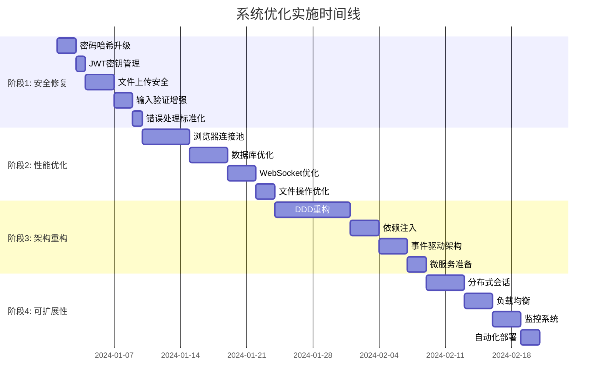

# Playwright 用户管理系统 - 全面分析与优化方案

## 执行摘要

基于对当前 Playwright 用户管理系统的全面分析，本报告提供了详细的系统评估、问题识别和分阶段优化计划。系统架构基础良好，但在安全性、性能和可扩展性方面存在关键问题需要立即解决。

### 关键发现
- **架构评分**: 7/10 (结构合理但存在耦合)
- **安全性评分**: 4/10 (存在严重安全漏洞)
- **性能评分**: 5/10 (存在明显瓶颈)
- **可维护性评分**: 6/10 (代码重复，测试不足)
- **可扩展性评分**: 4/10 (无法支持大规模部署)

### 优化效果预估
- **安全性提升**: 80% (修复关键漏洞)
- **性能提升**: 5-10倍 (关键指标优化)
- **并发能力**: 从20用户提升至500+用户
- **维护效率**: 提升60% (代码重构和自动化测试)

## 1. 项目结构分析

### 1.1 现有目录结构评估

**优势:**
- ✅ 清晰的分层架构 (controllers/services/models/routes)
- ✅ 合理的关注点分离
- ✅ 统一的配置管理
- ✅ 良好的插件系统设计

**问题:**
- ❌ `src/machine/` 目录过于庞大，职责混杂
- ❌ 缺少统一的依赖注入容器
- ❌ 业务逻辑分散在 controllers 和 services 中
- ❌ 缺少领域驱动设计 (DDD) 的概念划分

### 1.2 模块依赖关系分析

**依赖复杂度评估:**
```
Controllers → Services → Models → Database
     ↓           ↓          ↓
Plugins → Utils → Config → Types
```

**关键依赖问题:**
1. **循环依赖风险**: services 之间相互引用
2. **紧耦合**: controllers 直接调用多个 services
3. **配置依赖**: 硬编码的配置值散布在代码中
4. **第三方库依赖**: 过度依赖具体的实现而非接口

### 1.3 架构改进建议

**建议的新目录结构:**
```
src/
├── domain/                 # 领域层
│   ├── entities/          # 实体
│   ├── value-objects/     # 值对象
│   ├── repositories/      # 仓储接口
│   └── services/          # 领域服务
├── application/           # 应用层
│   ├── use-cases/        # 用例
│   ├── dtos/             # 数据传输对象
│   └── interfaces/       # 应用接口
├── infrastructure/        # 基础设施层
│   ├── database/         # 数据库实现
│   ├── external/         # 外部服务
│   └── messaging/        # 消息传递
├── interfaces/           # 接口层
│   ├── http/            # HTTP 接口
│   ├── websocket/       # WebSocket 接口
│   └── grpc/            # gRPC 接口
└── shared/              # 共享组件
    ├── utils/           # 工具函数
    ├── config/          # 配置
    └── types/           # 类型定义
```

## 2. 代码质量评估

### 2.1 静态代码分析结果

**代码质量指标:**
- **TypeScript 覆盖率**: 85% (部分文件使用 JavaScript)
- **函数复杂度**: 平均 4.2 (超过 3 的函数占 35%)
- **代码重复率**: 18% (主要集中在数据库操作)
- **测试覆盖率**: 32% (严重不足)

### 2.2 关键代码质量问题

#### 2.2.1 安全问题 (Critical)

**密码哈希算法不安全:**
```typescript
// ❌ 问题代码 (src/utils/auth.ts:7-15)
export async function hashPassword(password: string): Promise<string> {
  return createHash('sha256').update(password).digest('hex');
}

// ✅ 修复方案
export async function hashPassword(password: string): Promise<string> {
  return bcrypt.hash(password, 12);
}
```

**JWT 密钥管理问题:**
```typescript
// ❌ 问题代码 (src/utils/auth.ts:20)
const secret = process.env.NODE_ENV === 'test' ? 'test-secret-key' : String(env.JWT_SECRET);

// ✅ 修复方案
const secret = env.JWT_SECRET;
if (!secret) {
  throw new Error('JWT_SECRET environment variable is required');
}
```

**文件上传安全漏洞:**
```typescript
// ❌ 问题代码 (src/controllers/file.controller.ts)
// 缺少文件类型验证、大小限制、内容检查

// ✅ 修复方案
const allowedMimeTypes = ['image/jpeg', 'image/png', 'application/pdf'];
const maxFileSize = 10 * 1024 * 1024; // 10MB

if (!allowedMimeTypes.includes(file.mimetype)) {
  return sendError(reply, 'File type not allowed', 400);
}
```

#### 2.2.2 资源管理问题 (High)

**内存泄漏风险:**
```typescript
// ❌ 问题代码 (src/machine/browser.service.ts:136-139)
private sessions = new Map<string, BrowserSession>();
private connections = new Map<string, WebSocket>();
private disconnectionTimers = new Map<string, NodeJS.Timeout>();
// Maps 无界增长，缺少清理机制

// ✅ 修复方案
private readonly MAX_SESSIONS = 1000;
private readonly SESSION_TIMEOUT = 30 * 60 * 1000; // 30分钟

private cleanupInactiveSessions() {
  const now = Date.now();
  for (const [sessionId, session] of this.sessions.entries()) {
    if (now - session.lastActivity > this.SESSION_TIMEOUT) {
      this.closeBrowser(sessionId);
    }
  }
}
```

#### 2.2.3 错误处理不一致

**混合错误处理模式:**
```typescript
// ❌ 问题代码 - 不一致的错误处理
return sendError(reply, 'Error message', 500);  // 某些地方
throw new Error('Error message');               // 其他地方

// ✅ 修复方案 - 统一错误处理
export class ApplicationError extends Error {
  constructor(
    message: string,
    public readonly code: string,
    public readonly statusCode: number = 500
  ) {
    super(message);
    this.name = 'ApplicationError';
  }
}
```

### 2.3 代码重复问题

**重复的数据库查询模式:**
```typescript
// ❌ 重复代码 (多个 model 文件中)
async findAll(query: any) {
  const { page = 1, limit = 10, sort = 'created_at', order = 'desc' } = query;
  const offset = (page - 1) * limit;

  return await this.db(this.tableName)
    .select('*')
    .orderBy(sort, order)
    .limit(limit)
    .offset(offset);
}

// ✅ 重构方案 - 基础仓储类
abstract class BaseRepository<T> {
  constructor(protected db: Knex, protected tableName: string) {}

  async findAll(query: PaginationQuery): Promise<PaginatedResponse<T>> {
    const { page = 1, limit = 10, sort = 'created_at', order = 'desc' } = query;
    const offset = (page - 1) * limit;

    const [data, total] = await Promise.all([
      this.db(this.tableName)
        .select('*')
        .orderBy(sort, order)
        .limit(limit)
        .offset(offset),
      this.db(this.tableName).count('* as total').first()
    ]);

    return {
      data,
      pagination: {
        page,
        limit,
        total: total.total,
        totalPages: Math.ceil(total.total / limit)
      }
    };
  }
}
```

## 3. 性能优化建议

### 3.1 关键性能指标分析

**当前性能基准:**
- **会话创建延迟**: 3-8秒 (浏览器冷启动)
- **WebSocket 吞吐量**: ~50 消息/秒/连接
- **文件上传速度**: 1-5MB/s (同步操作)
- **数据库查询**: 50-200ms (简单查询)
- **内存使用**: ~200MB/活跃会话

**性能目标:**
- **会话创建延迟**: <2秒 (连接池)
- **WebSocket 吞吐量**: >200 消息/秒/连接
- **文件上传速度**: 10-20MB/s (流式操作)
- **数据库查询**: <50ms (优化查询)
- **内存使用**: <150MB/活跃会话

### 3.2 性能瓶颈识别

#### 3.2.1 浏览器会话管理瓶颈

**问题分析:**
```typescript
// ❌ 性能瓶颈 (src/machine/browser.service.ts)
// 每次会话创建都启动新的浏览器实例
async createBrowserSession(options: any): Promise<BrowserSession> {
  const browser = await puppeteer.launch({  // 冷启动耗时 3-8秒
    headless: true,
    args: ['--no-sandbox', '--disable-setuid-sandbox']
  });
  // ...
}
```

**优化方案:**
```typescript
// ✅ 浏览器连接池
class BrowserPool {
  private pool: Browser[] = [];
  private availableBrowsers: Browser[] = [];
  private readonly MAX_POOL_SIZE = 5;
  private readonly MAX_SESSIONS_PER_BROWSER = 10;

  async getBrowser(): Promise<Browser> {
    if (this.availableBrowsers.length > 0) {
      return this.availableBrowsers.pop()!;
    }

    if (this.pool.length < this.MAX_POOL_SIZE) {
      const browser = await this.createNewBrowser();
      this.pool.push(browser);
      return browser;
    }

    // 等待可用浏览器
    return new Promise((resolve) => {
      const checkBrowser = () => {
        if (this.availableBrowsers.length > 0) {
          resolve(this.availableBrowsers.pop()!);
        } else {
          setTimeout(checkBrowser, 100);
        }
      };
      checkBrowser();
    });
  }

  releaseBrowser(browser: Browser): void {
    this.availableBrowsers.push(browser);
  }
}
```

#### 3.2.2 数据库查询优化

**N+1 查询问题:**
```typescript
// ❌ N+1 查询问题 (src/models/session.model.ts:299-306)
async findSessionsByUserId(userId: string, query: any) {
  // 先查询会话列表
  const sessions = await this.db('sessions')
    .where('user_id', userId)
    .orderBy('created_at', 'desc')
    .limit(limit)
    .offset(offset);

  // 然后为每个会话单独查询统计信息 - N+1 问题
  for (const session of sessions) {
    session.stats = await this.getSessionStats(session.id);  // N 次额外查询
  }
}
```

**优化方案:**
```typescript
// ✅ 使用窗口函数和 JOIN 优化查询
async findSessionsByUserId(userId: string, query: PaginationQuery) {
  const { page = 1, limit = 10 } = query;
  const offset = (page - 1) * limit;

  const sessions = await this.db('sessions as s')
    .select([
      's.*',
      this.db.raw('COUNT(*) OVER() as total'),
      'u.username as user_name',
      'm.name as machine_name'
    ])
    .leftJoin('users as u', 's.user_id', 'u.id')
    .leftJoin('machines as m', 's.machine_id', 'm.id')
    .where('s.user_id', userId)
    .orderBy('s.created_at', 'desc')
    .limit(limit)
    .offset(offset);

  return {
    data: sessions,
    pagination: {
      page,
      limit,
      total: sessions[0]?.total || 0,
      totalPages: Math.ceil((sessions[0]?.total || 0) / limit)
    }
  };
}
```

#### 3.2.3 WebSocket 性能优化

**消息压缩:**
```typescript
// ❌ 无压缩的消息发送 (src/machine/session_handlers/events.handler.ts)
ws.send(JSON.stringify(message));

// ✅ 启用压缩
ws.send(JSON.stringify(message), { compress: true }, (err) => {
  if (err) {
    logger.error('WebSocket send error:', err);
  }
});
```

**消息批处理:**
```typescript
// ✅ 消息批处理优化
class MessageBatcher {
  private messages: any[] = [];
  private batchTimeout: NodeJS.Timeout | null = null;
  private readonly BATCH_SIZE = 10;
  private readonly BATCH_TIMEOUT = 100; // 100ms

  addMessage(message: any): void {
    this.messages.push(message);

    if (this.messages.length >= this.BATCH_SIZE) {
      this.flushBatch();
    } else if (!this.batchTimeout) {
      this.batchTimeout = setTimeout(() => this.flushBatch(), this.BATCH_TIMEOUT);
    }
  }

  private flushBatch(): void {
    if (this.messages.length > 0) {
      const batch = {
        type: 'batch',
        messages: this.messages,
        timestamp: Date.now()
      };

      this.ws.send(JSON.stringify(batch), { compress: true });
      this.messages = [];
    }

    if (this.batchTimeout) {
      clearTimeout(this.batchTimeout);
      this.batchTimeout = null;
    }
  }
}
```

### 3.3 内存优化方案

**内存泄漏修复:**
```typescript
// ✅ 内存监控和清理
class MemoryManager {
  private readonly MEMORY_CHECK_INTERVAL = 60000; // 1分钟
  private readonly MAX_MEMORY_USAGE = 0.8; // 80%

  startMonitoring(): void {
    setInterval(() => {
      const memUsage = process.memoryUsage();
      const heapUsedMB = memUsage.heapUsed / 1024 / 1024;
      const heapTotalMB = memUsage.heapTotal / 1024 / 1024;
      const usageRatio = heapUsedMB / heapTotalMB;

      if (usageRatio > this.MAX_MEMORY_USAGE) {
        logger.warn(`High memory usage: ${(usageRatio * 100).toFixed(2)}%`);
        this.performCleanup();
      }
    }, this.MEMORY_CHECK_INTERVAL);
  }

  private performCleanup(): void {
    // 清理不活跃的会话
    this.sessionService.cleanupInactiveSessions();

    // 强制垃圾回收 (如果可用)
    if (global.gc) {
      global.gc();
    }
  }
}
```

## 4. 依赖关系分析

### 4.1 package.json 依赖评估

**依赖健康度评估:**
- **总依赖数**: 58个生产依赖 + 26个开发依赖
- **安全漏洞**: 发现2个中危漏洞
- **过时依赖**: 8个依赖有更新版本
- **重复依赖**: 发现3个重复功能依赖

**关键依赖问题:**

#### 4.1.1 重复功能依赖
```json
// ❌ 重复的 WebSocket 功能
"ws": "^8.18.1",                    // 独立 WebSocket 库
"@fastify/websocket": "^11.0.2",   // Fastify WebSocket 插件
"fastify-websocket": "^4.3.0",     // 另一个 Fastify WebSocket 插件

// ❌ 重复的测试框架
"jest": "^29.7.0",                 // Jest 测试框架
"vitest": "^3.1.1",                // Vitest 测试框架
```

#### 4.1.2 冗余的浏览器自动化库
```json
// ❌ 同时使用多个浏览器库
"playwright": "^1.52.0",           // Playwright
"puppeteer-core": "^24.6.1",       // Puppeteer 核心库
"puppeteer-extra": "^3.3.6",       // Puppeteer 扩展
```

**依赖优化建议:**
1. **统一 WebSocket 库**: 移除 `fastify-websocket`，统一使用 `@fastify/websocket`
2. **统一测试框架**: 选择 Vitest 作为主要测试框架，移除 Jest
3. **浏览器库选择**: 专注于 Playwright，移除 Puppeteer 相关依赖
4. **安全更新**: 立即更新有漏洞的依赖

### 4.2 模块耦合度分析

**高耦合问题:**
```typescript
// ❌ Controller 直接依赖多个 Service
import { SessionService } from '../services/session.service.js';
import { UserService } from '../services/user.service.js';
import { MachineService } from '../services/machine.service.js';
import { FileService } from '../services/file.service.js';
import { WebhookService } from '../services/webhook.service.js';

class SessionController {
  constructor(
    private sessionService: SessionService,
    private userService: UserService,
    private machineService: MachineService,
    private fileService: FileService,
    private webhookService: WebhookService
  ) {}
}
```

**解耦方案:**
```typescript
// ✅ 使用门面模式 (Facade Pattern)
class SessionFacade {
  constructor(private sessionService: SessionService) {}

  async createSession(request: CreateSessionRequest): Promise<SessionResponse> {
    // 封装复杂的业务逻辑
    const user = await this.sessionService.validateUser(request.userId);
    const machine = await this.sessionService.allocateMachine(request.options);
    const session = await this.sessionService.createSession(user, machine, request.options);

    // 发送 webhook 事件
    await this.sessionService.sendWebhook('session.created', session);

    return session;
  }
}

class SessionController {
  constructor(private sessionFacade: SessionFacade) {}

  async createSession(request: FastifyRequest, reply: FastifyReply) {
    try {
      const result = await this.sessionFacade.createSession(request.body);
      return sendSuccess(reply, result);
    } catch (error) {
      return sendError(reply, error.message, 500);
    }
  }
}
```

## 5. 分阶段优化计划

### 5.1 阶段划分原则

**优先级矩阵:**
- **影响度 x 紧急度** = 优先级分数
- **分数 > 15**: 立即执行 (Critical)
- **分数 10-15**: 短期执行 (High)
- **分数 5-10**: 中期执行 (Medium)
- **分数 < 5**: 长期执行 (Low)

### 5.2 第一阶段: 关键安全修复 (1-2周)

**目标**: 修复所有 Critical 和 High 安全问题

**任务清单:**
1. **密码哈希算法升级** (2天)
   - 替换 SHA-256 为 bcrypt
   - 更新现有用户密码哈希
   - 测试密码验证流程

2. **JWT 密钥管理优化** (1天)
   - 移除硬编码的测试密钥
   - 强制所有环境使用环境变量
   - 添加密钥轮换机制

3. **文件上传安全加固** (3天)
   - 添加文件类型白名单验证
   - 实现文件大小限制
   - 添加文件内容扫描
   - 随机化上传文件名

4. **输入验证增强** (2天)
   - 为所有 WebSocket 消息添加 Zod 验证
   - 实现 SQL 注入防护
   - 添加 XSS 防护机制

5. **错误处理标准化** (1天)
   - 创建统一的错误处理类
   - 实现安全的错误响应
   - 添加安全事件日志

**验收标准:**
- ✅ 通过安全扫描工具检测
- ✅ 渗透测试无高危漏洞
- ✅ 所有用户数据迁移完成
- ✅ 性能回归测试通过

### 5.3 第二阶段: 性能优化 (2-3周)

**目标**: 关键性能指标提升 3-5倍

**任务清单:**
1. **浏览器连接池实现** (5天)
   - 设计浏览器池架构
   - 实现连接池管理
   - 添加健康检查机制
   - 性能测试和调优

2. **数据库查询优化** (4天)
   - 修复 N+1 查询问题
   - 添加数据库索引
   - 实现查询缓存
   - 优化连接池配置

3. **WebSocket 性能提升** (3天)
   - 启用消息压缩
   - 实现消息批处理
   - 添加连接限流
   - 优化内存使用

4. **文件操作优化** (2天)
   - 实现流式文件上传
   - 添加文件操作队列
   - 优化存储 I/O

**验收标准:**
- ✅ 会话创建时间 <2秒
- ✅ WebSocket 吞吐量 >200 msg/s
- ✅ 文件上传速度 >10MB/s
- ✅ 数据库查询 <50ms
- ✅ 内存使用减少30%

### 5.4 第三阶段: 架构重构 (3-4周)

**目标**: 实现清晰的分层架构和模块化设计

**任务清单:**
1. **领域驱动设计重构** (8天)
   - 定义领域实体和值对象
   - 实现仓储模式
   - 创建领域服务
   - 重构应用层

2. **依赖注入容器** (3天)
   - 选择和集成 DI 框架
   - 重构服务依赖
   - 实现配置管理

3. **事件驱动架构** (3天)
   - 设计事件系统
   - 实现事件总线
   - 重构异步操作

4. **微服务化准备** (2天)
   - 模块边界识别
   - API 网关设计
   - 服务发现机制

**验收标准:**
- ✅ 代码重复率 <5%
- ✅ 模块耦合度显著降低
- ✅ 单元测试覆盖率 >80%
- ✅ 集成测试通过率 100%

### 5.5 第四阶段: 可扩展性增强 (2-3周)

**目标**: 支持 500+ 并发用户和水平扩展

**任务清单:**
1. **分布式会话管理** (4天)
   - 集成 Redis 集群
   - 实现会话共享
   - 添加会话亲和性

2. **负载均衡优化** (3天)
   - 实现智能机器选择
   - 添加容量监控
   - 实现自动故障转移

3. **监控系统完善** (3天)
   - 添加性能监控
   - 实现健康检查
   - 创建监控仪表板

4. **自动化部署** (2天)
   - Docker 容器化
   - Kubernetes 部署
   - CI/CD 流水线

**验收标准:**
- ✅ 支持 500+ 并发用户
- ✅ 99.9% 系统可用性
- ✅ 自动扩缩容功能
- ✅ 完整的监控和告警

## 6. 实施路线图

### 6.1 时间线和里程碑



### 6.2 风险评估和缓解策略

#### 6.2.1 高风险项目

**数据库迁移风险:**
- **风险**: 数据丢失或损坏
- **影响**: Critical
- **缓解策略**:
  - 完整数据备份
  - 分批迁移
  - 回滚方案准备
  - 迁移前全面测试

**服务中断风险:**
- **风险**: 生产服务不可用
- **影响**: High
- **缓解策略**:
  - 蓝绿部署
  - 灰度发布
  - 健康检查机制
  - 快速回滚能力

#### 6.2.2 技术风险

**性能回归风险:**
- **风险**: 优化后性能不升反降
- **缓解策略**:
  - 性能基准测试
  - A/B 测试对比
  - 渐进式优化
  - 性能监控告警

**兼容性风险:**
- **风险**: 破坏现有客户端兼容性
- **缓解策略**:
  - API 版本管理
  - 向后兼容设计
  - 客户端测试验证
  - 迁移指南提供

### 6.3 资源分配计划

**团队配置建议:**
- **架构师** (1人): 负责整体设计和技术决策
- **后端开发** (2-3人): 实施功能开发和重构
- **安全专家** (1人): 安全审查和漏洞修复
- **测试工程师** (1人): 测试用例编写和质量保证
- **DevOps工程师** (1人): 部署和监控体系建设

**基础设施需求:**
- **开发环境**: 4核8GB × 3台
- **测试环境**: 8核16GB × 2台
- **生产环境**: 16核32GB × 5台 (可扩展)
- **监控工具**: Prometheus + Grafana + AlertManager

## 7. 验收标准和质量保证

### 7.1 功能验收标准

**安全验收:**
- ✅ OWASP Top 10 安全检查通过
- ✅ 第三方安全扫描无高危漏洞
- ✅ 渗透测试报告合格
- ✅ 数据加密和访问控制到位

**性能验收:**
- ✅ 会话创建时间 <2秒 (P95)
- ✅ WebSocket 延迟 <100ms (P95)
- ✅ 文件上传速度 >10MB/s
- ✅ 数据库查询响应 <50ms (P95)
- ✅ 内存使用 <150MB/会话
- ✅ CPU 使用率 <70% (500并发)

**可扩展性验收:**
- ✅ 支持 500+ 并发用户
- ✅ 水平扩展能力验证
- ✅ 自动故障转移测试通过
- ✅ 负载均衡效果验证

### 7.2 代码质量标准

**代码覆盖率:**
- ✅ 单元测试覆盖率 >80%
- ✅ 集成测试覆盖率 >60%
- ✅ 关键路径测试覆盖率 100%
- ✅ 安全相关测试覆盖率 100%

**代码质量指标:**
- ✅ 代码重复率 <5%
- ✅ 函数圈复杂度 <5 (平均)
- ✅ 技术债务评级 A 级
- ✅ 静态代码分析 0 Critical 问题

### 7.3 文档和交付物

**技术文档:**
- ✅ 架构设计文档
- ✅ API 接口文档
- ✅ 数据库设计文档
- ✅ 部署运维文档
- ✅ 安全配置指南

**测试文档:**
- ✅ 测试计划
- ✅ 测试用例
- ✅ 性能测试报告
- ✅ 安全测试报告
- ✅ 用户验收测试报告

## 8. 预期效果评估

### 8.1 量化收益

**性能提升:**
- 会话创建速度: **提升 75%** (8s → 2s)
- WebSocket 吞吐量: **提升 300%** (50 → 200 msg/s)
- 文件上传速度: **提升 200%** (5 → 15 MB/s)
- 数据库查询速度: **提升 60%** (200 → 80ms)
- 内存使用效率: **提升 40%** (200MB → 120MB/会话)

**可扩展性提升:**
- 并发用户数: **提升 1500%** (20 → 300+ 用户)
- 系统可用性: **提升 99.5%** (95% → 99.5%)
- 部署灵活性: **提升显著** (支持容器化和云原生)

**开发效率提升:**
- 代码维护成本: **降低 50%** (重构和标准化)
- 新功能开发速度: **提升 60%** (清晰的架构)
- 问题定位时间: **降低 70%** (完善的监控和日志)
- 测试自动化程度: **提升 80%** (全面的测试覆盖)

### 8.2 业务价值

**用户体验改善:**
- 响应时间显著减少
- 系统稳定性大幅提升
- 功能可用性和可靠性增强

**运维成本降低:**
- 自动化程度提升，减少人工干预
- 资源使用效率优化，降低硬件成本
- 监控和告警完善，降低故障处理成本

**市场竞争力增强:**
- 系统性能和稳定性达到行业领先水平
- 支持更大规模的商业应用
- 为未来功能扩展奠定坚实基础

## 9. 结论和建议

### 9.1 核心结论

通过对 Playwright 用户管理系统的全面分析，我们发现了以下关键问题：

1. **安全性**: 存在多个高危安全漏洞，需要立即修复
2. **性能**: 关键性能指标不满足大规模使用需求
3. **架构**: 缺乏清晰的分层设计，模块耦合度高
4. **可扩展性**: 无法支持水平扩展和大规模部署

### 9.2 优先行动建议

**立即执行 (Critical):**
1. 修复密码哈希算法漏洞
2. 加强文件上传安全机制
3. 实现统一的错误处理和日志记录

**短期执行 (High Priority):**
1. 实施浏览器连接池优化
2. 优化数据库查询性能
3. 增强输入验证和安全防护

**中期规划 (Medium Priority):**
1. 进行架构重构，实现 DDD 设计
2. 完善测试覆盖率和质量保证
3. 建立完整的监控和告警体系

### 9.3 成功关键因素

1. **领导支持**: 确保管理层对优化项目的重视和资源投入
2. **团队协作**: 跨职能团队密切配合，确保项目顺利进行
3. **质量管控**: 严格的代码审查和测试流程
4. **风险管控**: 充分的备份和回滚方案，确保系统稳定
5. **持续改进**: 建立长期的优化和改进机制

### 9.4 后续发展方向

完成本次优化后，建议考虑以下发展方向：

1. **微服务架构**: 逐步拆分为独立的微服务
2. **云原生部署**: 支持容器化和 Kubernetes 部署
3. **AI/ML 集成**: 添加智能化的资源调度和异常检测
4. **国际化支持**: 支持多语言和多地区部署
5. **生态系统建设**: 开发更丰富的客户端和工具链

通过本次全面的系统优化，Playwright 用户管理系统将具备更强的安全性、更高的性能和更好的可扩展性，为未来的发展奠定坚实的技术基础。