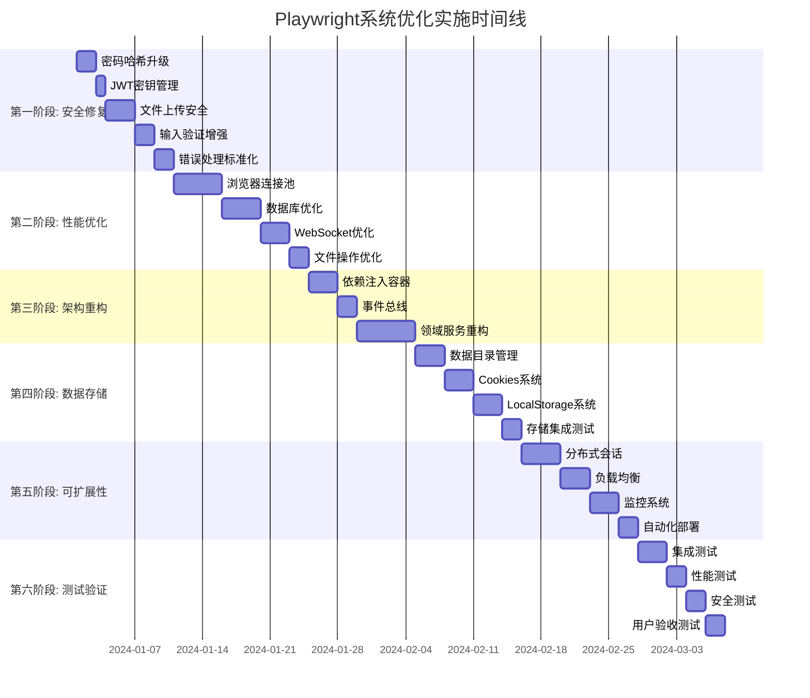

# 实施路线图

## 1. 分阶段实施计划

### 1.1 项目总体规划



### 1.2 详细阶段计划

#### 阶段一: 关键安全修复 (1-2周)

**目标**: 修复所有Critical和High级别安全问题

**任务清单和时间分配:**

| 任务 | 工作量 | 负责人 | 开始时间 | 结束时间 | 交付物 |
|------|--------|--------|----------|----------|---------|
| 密码哈希算法升级 | 2天 | 安全专家 | Day 1 | Day 2 | 升级后的密码模块 |
| JWT密钥管理优化 | 1天 | 后端开发 | Day 3 | Day 3 | 安全的JWT管理 |
| 文件上传安全加固 | 3天 | 安全专家 | Day 4 | Day 6 | 安全的文件上传 |
| 输入验证增强 | 2天 | 后端开发 | Day 7 | Day 8 | 统一验证机制 |
| 错误处理标准化 | 2天 | 后端开发 | Day 9 | Day 10 | 统一错误处理 |

**验收标准:**
- ✅ 通过OWASP安全扫描
- ✅ 渗透测试无高危漏洞
- ✅ 代码安全评审通过

#### 阶段二: 性能优化 (2-3周)

**目标**: 关键性能指标提升3-5倍

**任务清单和时间分配:**

| 任务 | 工作量 | 负责人 | 开始时间 | 结束时间 | 交付物 |
|------|--------|--------|----------|----------|---------|
| 浏览器连接池实现 | 5天 | 后端开发 | Day 11 | Day 15 | 连接池组件 |
| 数据库查询优化 | 4天 | DBA + 后端 | Day 16 | Day 19 | 优化的数据库 |
| WebSocket性能提升 | 3天 | 后端开发 | Day 20 | Day 22 | 优化的WebSocket |
| 文件操作优化 | 2天 | 后端开发 | Day 23 | Day 24 | 流式文件处理 |

**验收标准:**
- ✅ 会话创建时间 <2秒
- ✅ WebSocket吞吐量 >200 msg/s
- ✅ 数据库查询 <50ms
- ✅ 文件上传速度 >10MB/s

#### 阶段三: 架构重构 (2-3周)

**目标**: 实现清晰的分层架构

**任务清单和时间分配:**

| 任务 | 工作量 | 负责人 | 开始时间 | 结束时间 | 交付物 |
|------|--------|--------|----------|----------|---------|
| 依赖注入容器 | 3天 | 架构师 | Day 25 | Day 27 | DI容器 |
| 事件总线实现 | 2天 | 架构师 | Day 28 | Day 29 | 事件系统 |
| 领域服务重构 | 6天 | 后端团队 | Day 30 | Day 35 | 重构的领域层 |

**验收标准:**
- ✅ 代码重复率 <5%
- ✅ 模块耦合度显著降低
- ✅ 单元测试覆盖率 >80%

#### 阶段四: 数据存储系统 (2周)

**目标**: 实现安全的数据隔离和管理

**任务清单和时间分配:**

| 任务 | 工作量 | 负责人 | 开始时间 | 结束时间 | 交付物 |
|------|--------|--------|----------|----------|---------|
| 数据目录管理 | 3天 | 后端开发 | Day 36 | Day 38 | 目录管理服务 |
| Cookies系统 | 3天 | 后端开发 | Day 39 | Day 41 | Cookies管理 |
| LocalStorage系统 | 3天 | 后端开发 | Day 42 | Day 44 | LocalStorage管理 |
| 存储集成测试 | 2天 | 测试工程师 | Day 45 | Day 46 | 测试报告 |

**验收标准:**
- ✅ 数据隔离有效
- ✅ 安全访问控制
- ✅ 性能满足要求

#### 阶段五: 可扩展性增强 (2周)

**目标**: 支持500+并发用户

**任务清单和时间分配:**

| 任务 | 工作量 | 负责人 | 开始时间 | 结束时间 | 交付物 |
|------|--------|--------|----------|----------|---------|
| 分布式会话管理 | 4天 | 架构师 | Day 47 | Day 50 | Redis集群 |
| 负载均衡优化 | 3天 | DevOps | Day 51 | Day 53 | 负载均衡配置 |
| 监控系统完善 | 3天 | DevOps | Day 54 | Day 56 | 监控仪表板 |
| 自动化部署 | 2天 | DevOps | Day 57 | Day 58 | CI/CD流水线 |

**验收标准:**
- ✅ 支持500+并发用户
- ✅ 99.9%系统可用性
- ✅ 自动扩缩容功能

#### 阶段六: 测试验证 (1周)

**目标**: 全面验证系统质量

**任务清单和时间分配:**

| 任务 | 工作量 | 负责人 | 开始时间 | 结束时间 | 交付物 |
|------|--------|--------|----------|----------|---------|
| 集成测试 | 3天 | 测试团队 | Day 59 | Day 61 | 集成测试报告 |
| 性能测试 | 2天 | 测试团队 | Day 62 | Day 63 | 性能测试报告 |
| 安全测试 | 2天 | 安全专家 | Day 64 | Day 65 | 安全测试报告 |
| 用户验收测试 | 2天 | 产品团队 | Day 66 | Day 67 | UAT报告 |

## 2. 风险评估和回滚方案

### 2.1 风险矩阵

| 风险项目 | 概率 | 影响 | 风险等级 | 缓解措施 |
|----------|------|------|----------|----------|
| 数据迁移失败 | 中 | 高 | 高 | 完整备份 + 分批迁移 |
| 性能回退 | 低 | 高 | 中 | 性能基准 + 监控告警 |
| 安全漏洞引入 | 中 | 高 | 高 | 安全扫描 + 代码审查 |
| 兼容性问题 | 中 | 中 | 中 | 版本管理 + 测试覆盖 |
| 服务中断 | 低 | 高 | 中 | 蓝绿部署 + 快速回滚 |

### 2.2 详细回滚方案

#### 2.2.1 数据库回滚方案

```bash
#!/bin/bash
# 数据库回滚脚本

# 1. 停止应用服务
systemctl stop playwright-server

# 2. 数据库备份恢复
mysql -u root -p playwright_db < backup_$(date +%Y%m%d_%H%M%S).sql

# 3. 回滚数据库版本
cd /opt/playwright/migrations
knex migrate:rollback --all

# 4. 验证数据完整性
python scripts/verify_data_integrity.py

# 5. 重启应用服务
systemctl start playwright-server

# 6. 健康检查
curl -f http://localhost:3000/health || exit 1
```

#### 2.2.2 应用服务回滚方案

```yaml
# Docker Compose 回滚配置
version: '3.8'
services:
  app:
    image: playwright-user-sys:${PREVIOUS_VERSION}
    environment:
      - NODE_ENV=production
      - ROLLBACK_MODE=true
    volumes:
      - ./backups:/backups
    restart: unless-stopped
```

#### 2.2.3 配置回滚方案

```typescript
// 配置版本管理
export class ConfigRollbackManager {
  private readonly configVersions = new Map<string, ConfigVersion>();

  async rollbackConfig(version: string): Promise<void> {
    const configVersion = this.configVersions.get(version);
    if (!configVersion) {
      throw new Error(`Config version ${version} not found`);
    }

    // 备份当前配置
    await this.backupCurrentConfig();

    // 恢复指定版本配置
    await this.restoreConfig(configVersion);

    // 验证配置有效性
    await this.validateConfig(configVersion);

    // 重启相关服务
    await this.restartServices();
  }
}
```

### 2.3 紧急响应流程

#### 2.3.1 服务中断响应

1. **检测** (5分钟内)
   - 监控系统自动告警
   - 运维人员确认问题

2. **评估** (10分钟内)
   - 确定影响范围
   - 评估回滚风险

3. **决策** (5分钟内)
   - 决定是否回滚
   - 制定回滚计划

4. **执行** (15分钟内)
   - 执行回滚操作
   - 验证服务恢复

5. **复盘** (1小时内)
   - 分析问题原因
   - 更新应急流程

#### 2.3.2 数据安全问题响应

1. **隔离** (立即)
   - 停止受影响的服务
   - 保留现场证据

2. **评估** (30分钟内)
   - 确定数据泄露范围
   - 评估安全风险

3. **修复** (2小时内)
   - 修复安全漏洞
   - 更新安全策略

4. **通知** (必要时)
   - 通知受影响用户
   - 报告监管机构

## 3. 各环节验收标准

### 3.1 安全验收标准

#### 3.1.1 安全测试清单

- ✅ **OWASP Top 10**: 无高危漏洞
- ✅ **SQL注入**: 所有输入参数化
- ✅ **XSS防护**: 输出编码和CSP策略
- ✅ **CSRF防护**: Token验证机制
- ✅ **认证安全**: 强密码策略和安全存储
- ✅ **授权控制**: 基于角色的访问控制
- ✅ **数据加密**: 传输和存储加密
- ✅ **日志审计**: 完整的安全事件日志

#### 3.1.2 安全工具扫描

```bash
# OWASP ZAP 扫描
docker run -t owasp/zap2docker-stable zap-baseline.py -t http://target:3000

# 安全代码扫描
npm audit --audit-level=high
semgrep --config=auto src/

# 依赖漏洞扫描
snyk test
```

### 3.2 性能验收标准

#### 3.2.1 性能指标

| 指标 | 当前值 | 目标值 | 测试方法 |
|------|--------|--------|----------|
| 会话创建时间 | 3-8秒 | <2秒 | 压力测试 |
| WebSocket延迟 | 100-500ms | <100ms | 延迟测试 |
| 数据库查询 | 50-200ms | <50ms | 查询分析 |
| 文件上传速度 | 1-5MB/s | >10MB/s | 传输测试 |
| 内存使用 | 200MB/会话 | <150MB/会话 | 内存监控 |
| 并发用户数 | 20用户 | 500+用户 | 负载测试 |

#### 3.2.2 性能测试方案

```typescript
// 性能测试脚本
import { check, sleep } from 'k6';
import http from 'k6/http';

export let options = {
  stages: [
    { duration: '2m', target: 100 },
    { duration: '5m', target: 100 },
    { duration: '2m', target: 200 },
    { duration: '5m', target: 200 },
    { duration: '2m', target: 0 },
  ],
  thresholds: {
    http_req_duration: ['p(95)<200'], // 95%请求在200ms内
    http_req_failed: ['rate<0.1'],    // 失败率<10%
  },
};

export default function() {
  let response = http.post('http://localhost:3000/api/sessions', {
    json: { /* session config */ }
  });

  check(response, {
    'status is 200': (r) => r.status === 200,
    'response time <200ms': (r) => r.timings.duration < 200,
  });

  sleep(1);
}
```

### 3.3 功能验收标准

#### 3.3.1 核心功能测试

- ✅ **用户认证**: 登录、注册、密码重置
- ✅ **会话管理**: 创建、连接、断开、删除
- ✅ **浏览器控制**: 页面导航、元素操作、事件处理
- ✅ **文件管理**: 上传、下载、清理
- ✅ **权限控制**: 基于角色的访问控制
- ✅ **监控告警**: 系统状态监控和异常告警

#### 3.3.2 集成测试场景

```typescript
describe('Playwright系统集成测试', () => {
  test('完整会话生命周期', async () => {
    // 1. 用户登录
    const loginResult = await authService.login(credentials);
    expect(loginResult.token).toBeDefined();

    // 2. 创建会话
    const session = await sessionService.createSession(sessionConfig);
    expect(session.id).toBeDefined();
    expect(session.status).toBe('active');

    // 3. 连接到浏览器
    const browser = await browserService.connect(session.id);
    expect(browser).toBeDefined();

    // 4. 执行浏览器操作
    const page = await browser.newPage();
    await page.goto('https://example.com');
    expect(await page.title()).toBe('Example Domain');

    // 5. 清理会话
    await sessionService.deleteSession(session.id);
    expect(await sessionService.getSession(session.id)).toBeNull();
  });

  test('并发会话处理', async () => {
    const sessions = [];

    // 创建多个并发会话
    for (let i = 0; i < 10; i++) {
      const session = await sessionService.createSession(sessionConfig);
      sessions.push(session);
    }

    // 验证所有会话都正常创建
    expect(sessions).toHaveLength(10);
    sessions.forEach(session => {
      expect(session.status).toBe('active');
    });

    // 清理所有会话
    await Promise.all(
      sessions.map(session => sessionService.deleteSession(session.id))
    );
  });
});
```

### 3.4 可维护性验收标准

#### 3.4.1 代码质量指标

| 指标 | 当前值 | 目标值 | 检查工具 |
|------|--------|--------|----------|
| 代码覆盖率 | 32% | >80% | Jest/Coverage |
| 圈复杂度 | 4.2 | <5 | ESLint/Complexity |
| 代码重复率 | 18% | <5% | SonarQube |
| 技术债务评级 | C | A | SonarQube |
| 安全漏洞 | 2个 | 0个 | Snyk/NPM Audit |

#### 3.4.2 文档完整性

- ✅ **API文档**: Swagger/OpenAPI规范
- ✅ **架构文档**: 系统设计和部署指南
- ✅ **运维文档**: 监控、备份、故障处理
- ✅ **开发文档**: 代码规范、测试指南
- ✅ **用户文档**: 使用手册、FAQ

### 3.5 可扩展性验收标准

#### 3.5.1 扩展性测试

```bash
# 扩展性测试脚本
#!/bin/bash

# 测试水平扩展
echo "Testing horizontal scaling..."
kubectl scale deployment playwright-server --replicas=5
sleep 30

# 验证所有实例正常运行
kubectl get pods -l app=playwright-server

# 执行负载测试
k6 run --vus 500 --duration 5m load-test.js

# 检查系统指标
kubectl top pods -l app=playwright-server
```

#### 3.5.2 扩展性指标

| 指标 | 目标值 | 测试方法 |
|------|--------|----------|
| 并发用户数 | 500+ | 负载测试 |
| 水平扩展时间 | <5分钟 | 部署测试 |
| 故障恢复时间 | <1分钟 | 故障注入 |
| 数据一致性 | 100% | 一致性测试 |

## 4. 质量保证体系

### 4.1 持续集成/持续部署 (CI/CD)

#### 4.1.1 CI流水线

```yaml
# .github/workflows/ci.yml
name: CI Pipeline

on:
  push:
    branches: [ main, develop ]
  pull_request:
    branches: [ main ]

jobs:
  test:
    runs-on: ubuntu-latest
    strategy:
      matrix:
        node-version: [18.x, 20.x]

    steps:
    - uses: actions/checkout@v3

    - name: Setup Node.js
      uses: actions/setup-node@v3
      with:
        node-version: ${{ matrix.node-version }}

    - name: Install dependencies
      run: npm ci

    - name: Run linting
      run: npm run lint

    - name: Run type checking
      run: npm run type-check

    - name: Run unit tests
      run: npm run test:unit

    - name: Run integration tests
      run: npm run test:integration

    - name: Upload coverage
      uses: codecov/codecov-action@v3

  security:
    runs-on: ubuntu-latest
    steps:
    - uses: actions/checkout@v3

    - name: Run security audit
      run: npm audit --audit-level=high

    - name: Run Snyk security scan
      uses: snyk/actions/node@master
      env:
        SNYK_TOKEN: ${{ secrets.SNYK_TOKEN }}
```

#### 4.1.2 CD流水线

```yaml
# .github/workflows/cd.yml
name: CD Pipeline

on:
  workflow_run:
    workflows: ["CI Pipeline"]
    types:
      - completed
    branches: [main]

jobs:
  deploy:
    if: ${{ github.event.workflow_run.conclusion == 'success' }}
    runs-on: ubuntu-latest
    environment: production

    steps:
    - uses: actions/checkout@v3

    - name: Build Docker image
      run: |
        docker build -t playwright-sys:${{ github.sha }} .
        docker tag playwright-sys:${{ github.sha }} playwright-sys:latest

    - name: Deploy to production
      run: |
        kubectl set image deployment/playwright-server \
          app=playwright-sys:${{ github.sha }}

    - name: Health check
      run: |
        kubectl rollout status deployment/playwright-server
        curl -f http://playwright.example.com/health
```

### 4.2 监控和告警

#### 4.2.1 监控指标

```typescript
// 监控指标定义
export const performanceMetrics = {
  // 业务指标
  sessionCreationDuration: 'histogram',
  sessionActiveCount: 'gauge',
  browserUtilization: 'gauge',

  // 技术指标
  httpRequestDuration: 'histogram',
  databaseQueryDuration: 'histogram',
  memoryUsage: 'gauge',
  cpuUsage: 'gauge',

  // 错误指标
  errorRate: 'counter',
  failedAuthentications: 'counter',
  sessionTimeouts: 'counter',
};
```

#### 4.2.2 告警规则

```yaml
# Prometheus告警规则
groups:
- name: playwright-alerts
  rules:
  - alert: HighErrorRate
    expr: rate(http_requests_total{status=~"5.."}[5m]) > 0.1
    for: 2m
    labels:
      severity: critical
    annotations:
      summary: "High error rate detected"

  - alert: HighMemoryUsage
    expr: process_resident_memory_bytes / 1024 / 1024 > 1000
    for: 5m
    labels:
      severity: warning
    annotations:
      summary: "High memory usage detected"

  - alert: DatabaseSlowQueries
    expr: histogram_quantile(0.95, rate(db_query_duration_seconds_bucket[5m])) > 0.1
    for: 3m
    labels:
      severity: warning
    annotations:
      summary: "Slow database queries detected"
```

### 4.3 故障处理手册

#### 4.3.1 常见故障处理

| 故障类型 | 症状 | 原因 | 解决方案 | 预防措施 |
|----------|------|------|----------|----------|
| 服务不可用 | HTTP 503 | 服务崩溃 | 重启服务 | 健康检查 |
| 数据库连接失败 | 连接超时 | 连接池耗尽 | 扩大连接池 | 连接监控 |
| 内存泄漏 | 内存持续增长 | 资源未释放 | 重启服务 | 内存监控 |
| 磁盘空间不足 | 写入失败 | 日志文件过大 | 清理日志 | 自动清理 |
| 认证失败 | 401错误 | JWT密钥问题 | 更新密钥 | 密钥轮换 |

#### 4.3.2 应急联系信息

```yaml
emergency_contacts:
  primary_oncall:
    name: "张三"
    phone: "+86-138-xxxx-xxxx"
    email: "zhangsan@example.com"

  secondary_oncall:
    name: "李四"
    phone: "+86-139-xxxx-xxxx"
    email: "lisi@example.com"

  escalation_manager:
    name: "王五"
    phone: "+86-137-xxxx-xxxx"
    email: "wangwu@example.com"

  security_team:
    email: "security@example.com"
    slack: "#security-alerts"
```

通过以上详细的实施路线图，我们将确保项目的顺利进行，及时发现和解决问题，最终实现预期的优化目标。